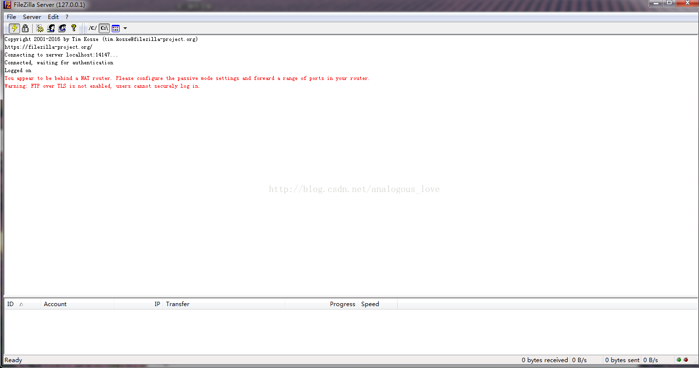

# FTP软件 filezilla 客户端和服务器全套源码

 filezilla是一款高性能ftp/sftp文件工具，关于它的具体的介绍可参见其官网：https://www.filezilla.cn/。其原作者是Tim Kosse (tim.kosse@filezilla-project.org)。

大概10年前我从校园网ftp资源时无意中接触到这款软件的客户端之后，其强大的功能和流畅的性能让我一直使用至今。即使在今天，我的开发环境已经换成[Linux](http://lib.csdn.net/base/linux)，我仍然使用它在windows与[linux](http://lib.csdn.net/base/linux)服务器目录互传文件资源，另外像qq这些即时通讯软件不支持大于4G的文件传输，filezilla也能够支持的。

 

   原作者的开发环境使用的是跨平台交叉编译的，对于我这种习惯使用Visual Studio开发windows程序的人来说，实在不方便；而直接下载的filezilla server也无法直接编译，经过我的修改也能使用VS进行编译和调试。

   软件界面如下：

客户端：

 

 

服务器端包括，两个程序，一个是以windows服务形式运行的filezillaserver，另外一个是对服务器端连接的用户账号、共享目录等信息进行控制的filezillaserverinterface：

 

**代码下载方法：关注【高性能服务器开发】公众号，回复关键字“filezilla”即可得到源码。**

 

**编译方法：** 

1. 编译filezilla客户端用VS2013打开filezillaclient\clien\src\FileZilla.sln编译即可。
2. 编译filezillaserver用VS2015打开filezillaserver\filezillaserver\filezillaserver.sln编译即可。
3. 编译filezillaserverinterface用VS2015打开filezillaserverinterface\filezillaserver\filezillaserverinterface.sln编译即可。

 

 

注意： 客户端使用C++11开发，而之所以服务器端的filezillaserver和filezillaserver选择使用较新的VS2015，是因为服务器端的代码使用了C++14的一些特性，而VS2013是不支持C++14的所有的特性的。

客户端代码，使用了很多第三方库，比如界面库wxWidgets、zlib、sqlite等。

   而项目中的CAsyncSocketEx模仿了mfc的CAsyncSocket，但是效率比mfc的CAsyncSocket要高。这个类可以直接拿到其它项目中使用的，比如电驴的源码就是直接使用了这个类。整个项目很有特色的地方是在支线程中使用windows的消息队列来代替传统的自定义消息队列。同时也是对ftp协议的实现。整个项目的代码质量也比较高。

   代码下载方法：扫描下面的微信公众号二维码关注后回复关键字“**获取filezilla源码**”即可得到下载链接。

