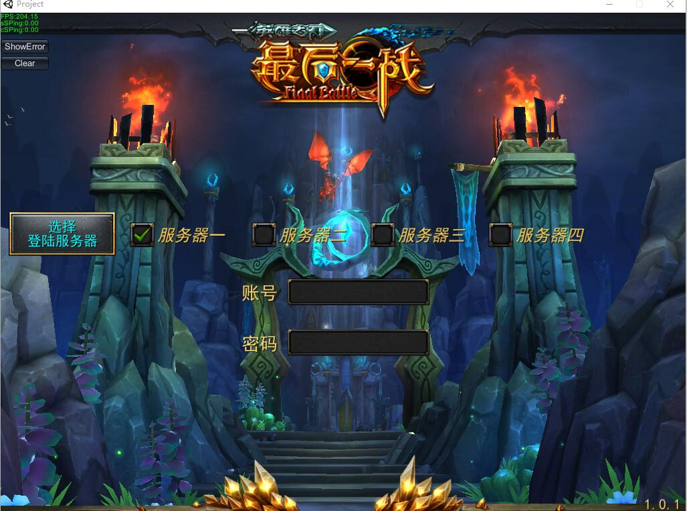
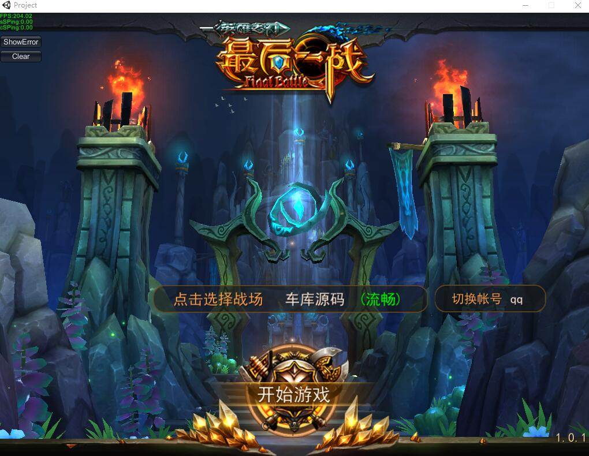
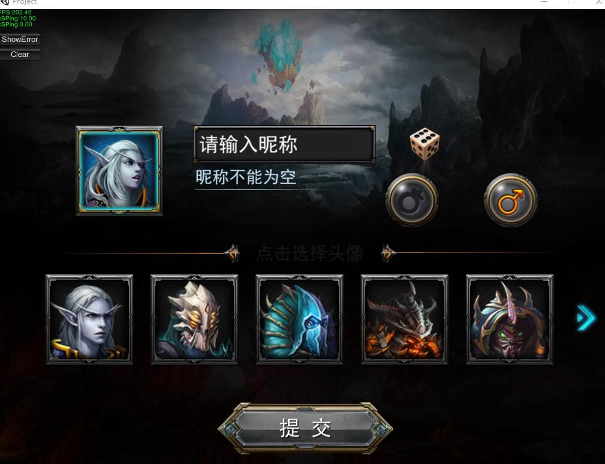
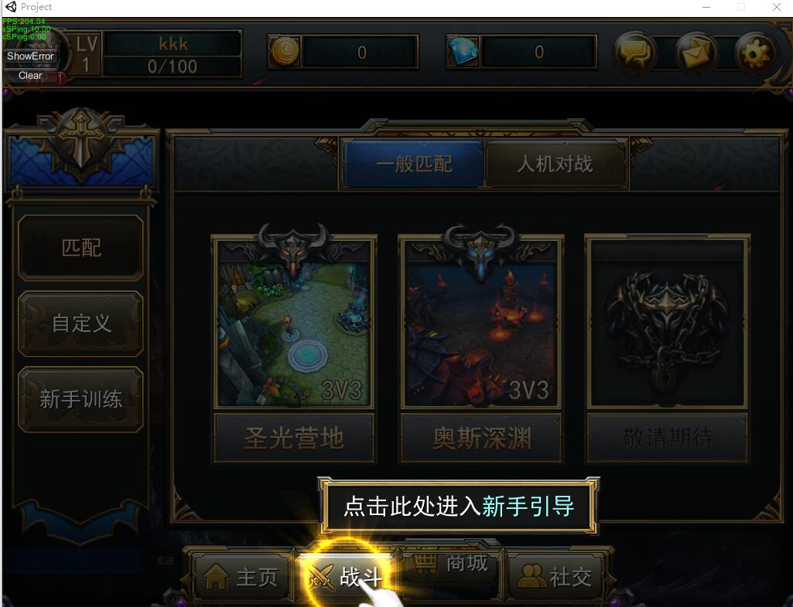
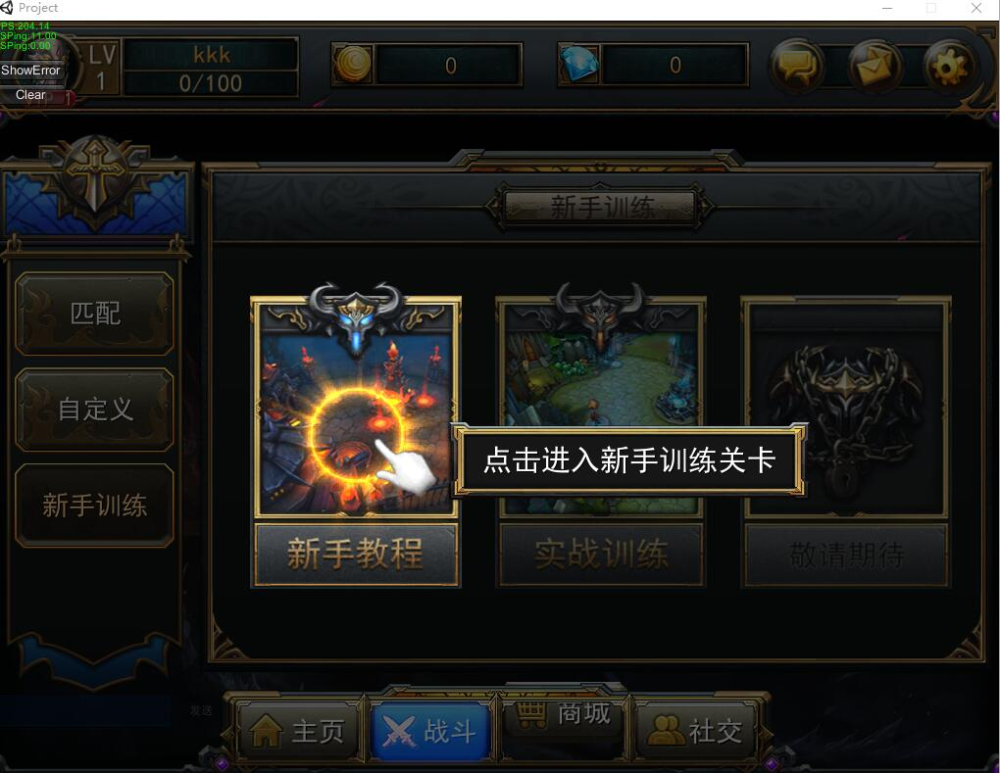
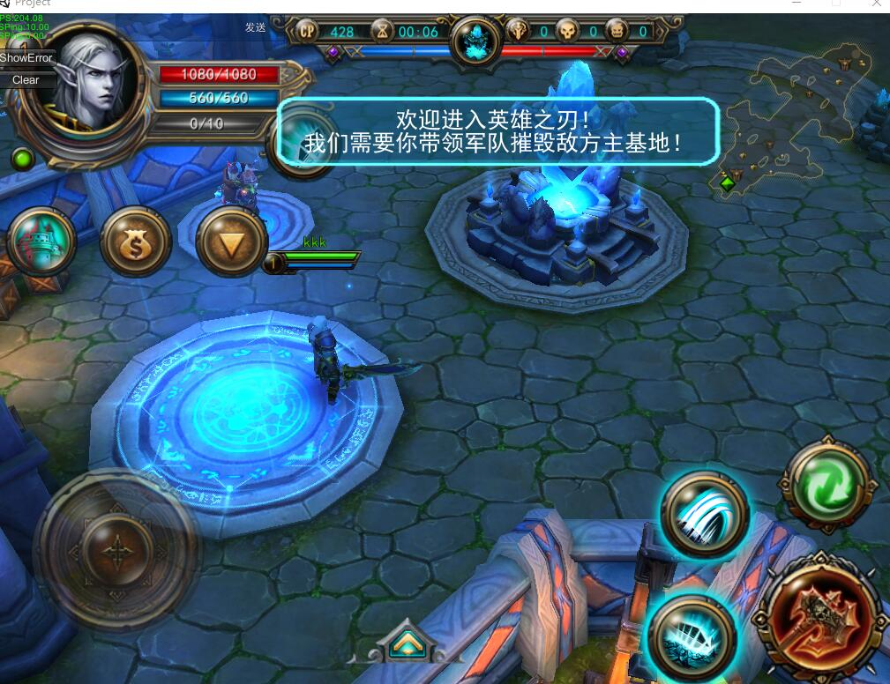
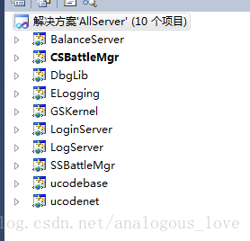

# MOBA游戏——最后一战

我们先来看下这个游戏的内容吧，下面给出游戏画面的部分截图：

 

 

 

 

这是一款类似于王者荣耀、dota之类的5v5实时RPG竞技游戏。

## 代码下载方法

关注“**高性能服务器开发**”公众号，回复关键字“**英雄联盟**”即可得到下载链接。

 

先介绍一下推荐的源码的运行和开发环境（我的配置）：

Windows 7

Visual Studio 2010

 

服务器端有非常多的模块，这里先截一张主要模块的项目图示：

 