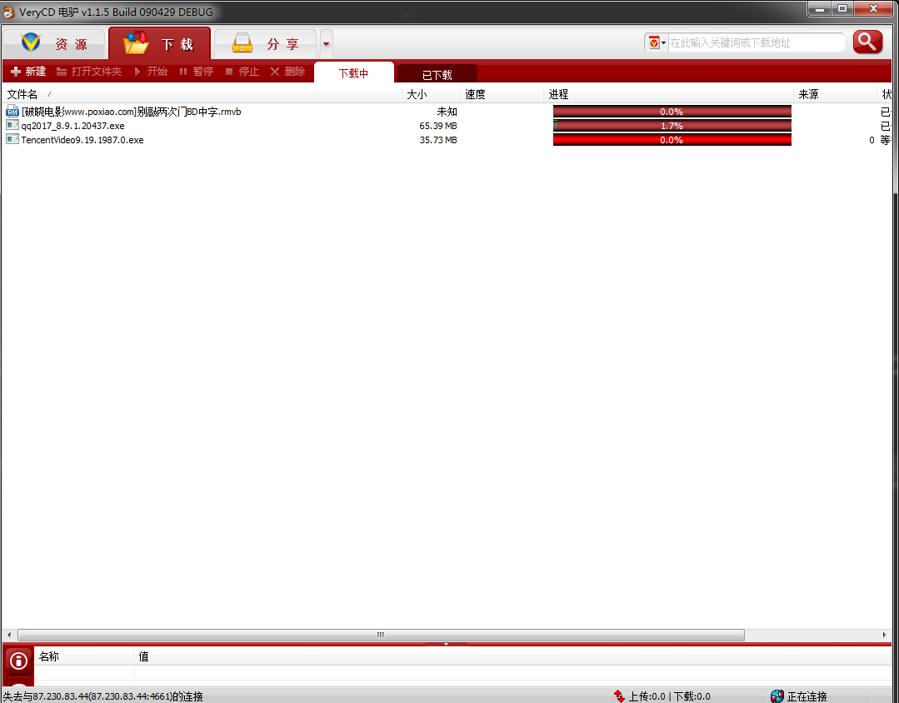
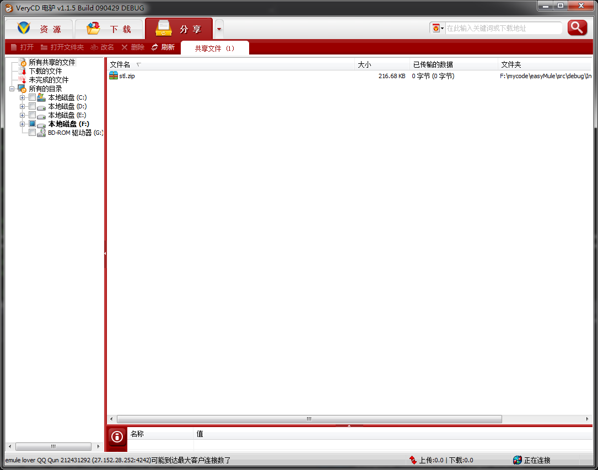
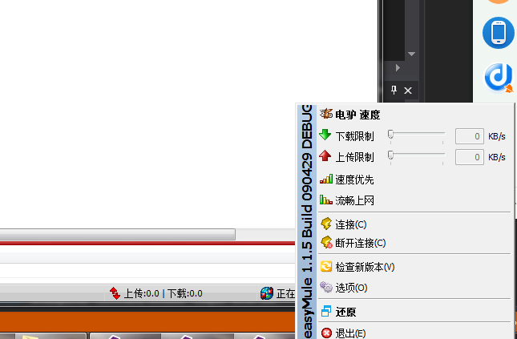
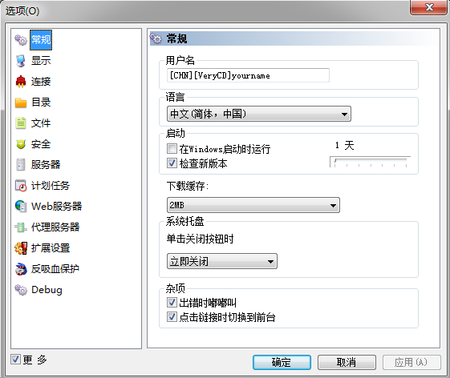
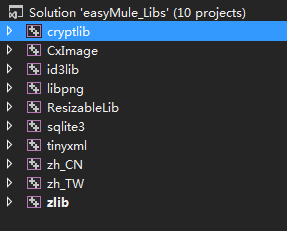

# 电驴源码

这里分享一款资源分享与下载工具——emule，其实严格来说，应该叫电骡，这是我维护的版本，eMuleVeryCD版本，VeryCD是一个不错的资源分享网站：http://www.verycd.com/ 。大概在08年之前，中国市场流行的下载工具大概有三款：网际快车（flashget）、电驴（eMule）和迅雷，后来前两者都没落了。电驴的源码也开源了，迅雷抓住这个机会分析了电驴的下载协议（Kademlia），所以现在的迅雷也能解析emule的下载协议，凡是能用emule下载的链接，也能用迅雷下载。这是一些前尘往事吧。其实我蛮怀念那个时候的。

先看下软件功能截图吧。

## **编译方法：**

1.将rcdll.dll复制到Visual Studio 2013安装目录的VC\bin目录中。（这是为了使用能在vista下显示的图标）

2. 用VS2013打开easyMule_Libs.sln，执行“生成解决方案”。（easyMule_Libs.sln里所包含的是easyMule所依赖的库文件。）

3.用VS2013打开easyMule.sln编译即可。

电驴服务器列表(eMule server list)：http://gruk.org/list.php   ed2k://|server|27.152.28.252|4242|/

这个是我维护的easyMule版本，由于不断的修改，可能会离原来的版本越来越远。

emule的整个工程是mfc项目，里面使用的socket通信库是filezilla作者Tim Kosse在其开源项目filezilla中使用的CAsyncSocketEx，这是一个模仿mfc的CAsyncSocket类，但据说效率高于CAsyncSocket的类。

## 代码特点

emule的代码虽然设计上不是最好的，但从代码风格和命名来说绝对是非常优良的，尤其是其变量、类名、函数等命名风格，真的是赏心悦目。而且其工程中的大多数类都可以直接拿来使用，比如http类CHttpClient、ftp类CFtpClient、线程池类CMemPool等。另外其使用的大量常用的库，如图形库CxImage、轻量级存储库sqlite3、解析xml库tinyXML、加密压缩库cryptlib和zlib等，也为我们学习和使用这些库提供了一个捷径，有图为证：

我曾经写过一篇emule源码分析的入门文章，面向的初学者的，如果你有兴趣可以看看：http://www.docin.com/p-668034568.html。

**代码下载方法**

关注【**CppGuide**】公众号，回复关键字“**获取电驴源码**”即可得到源码。

如果你在使用或者阅读这份电驴源码的过程中遇到什么问题，欢迎留言。也可以加入我们的QQ技术交流群：729995516。

Enjoy it！